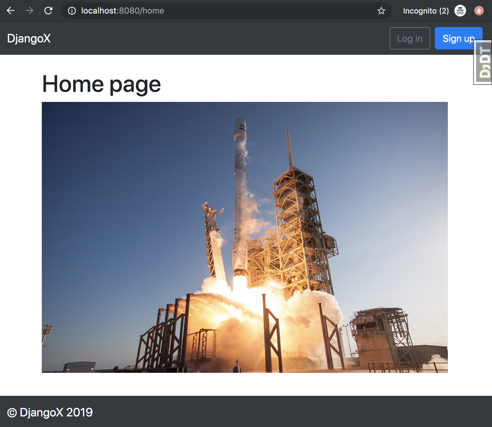
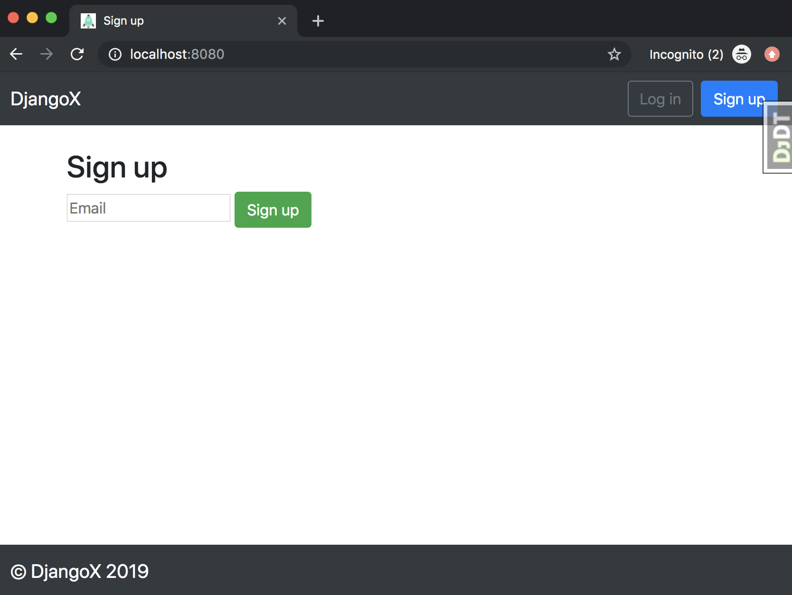

# DRF-Django-X

This is a template for a Django Rest Framework project exposing endpoints for a React Native mobile app


> **NOTE**: This open source project is supported by my two published books [Django for Beginners](https://djangoforbeginners.com/) and [Django for APIs](https://djangoforapis.com). Both of which have the first few chapters available for free online. Please take a look!


## Features

- For Django 2.2 and Python 3.7
- Modern virtual environments with [pipenv](https://github.com/pypa/pipenv)
- Styling with [Bootstrap](https://github.com/twbs/bootstrap) v4.1.3
- Custom user model
- Email/password for log in/sign up instead of Django's default username/email/password pattern
- Social authentication via [django-allauth](https://github.com/pennersr/django-allauth)
- [django-debug-toolbar](https://github.com/jazzband/django-debug-toolbar)

## First-time setup

1.  Make sure Python 3.7x and Pipenv are already installed. [See here for help](https://djangoforbeginners.com/initial-setup/).
2.  Clone the repo and configure the virtual environment:

```
$ git clone https://github.com/franciscojavierarceo/drf-django-x.git
$ cd drf-django-x
$ docker-compose run web bash build.sh 
# If running this again locally try:
$ docker volume rm drf-django-x_postgres_data
$ docker-compose up --build -d
$ docker-compose run web bash build.sh 
```

3. Run the build script
    - note this creates a default user with the following details:
        - username: admin
        - email: admin@djangox.com
        - password: password123

```
(djangox-1) bash-3.2$ source build.sh 
Operations to perform:
  Apply all migrations: account, admin, auth, contenttypes, sessions, sites, users
Running migrations:
  Applying contenttypes.0001_initial... OK
  Applying contenttypes.0002_remove_content_type_name... OK
  Applying auth.0001_initial... OK
  Applying auth.0002_alter_permission_name_max_length... OK
  Applying auth.0003_alter_user_email_max_length... OK
  Applying auth.0004_alter_user_username_opts... OK
  Applying auth.0005_alter_user_last_login_null... OK
  Applying auth.0006_require_contenttypes_0002... OK
  Applying auth.0007_alter_validators_add_error_messages... OK
  Applying auth.0008_alter_user_username_max_length... OK
  Applying auth.0009_alter_user_last_name_max_length... OK
  Applying auth.0010_alter_group_name_max_length... OK
  Applying auth.0011_update_proxy_permissions... OK
  Applying users.0001_initial... OK
  Applying account.0001_initial... OK
  Applying account.0002_email_max_length... OK
  Applying admin.0001_initial... OK
  Applying admin.0002_logentry_remove_auto_add... OK
  Applying admin.0003_logentry_add_action_flag_choices... OK
  Applying sessions.0001_initial... OK
  Applying sites.0001_initial... OK
  Applying sites.0002_alter_domain_unique... OK
No changes detected
```

4.  Confirm everything is working:

```
(djangox-1) $ python manage.py runserver
```

Load the site at [http://127.0.0.1:8000](http://127.0.0.1:8000).





## Next Steps

- Use [PostgreSQL locally via Docker](https://wsvincent.com/django-docker-postgresql/)
- Use [django-environ](https://github.com/joke2k/django-environ) for environment variables
- Update [EMAIL_BACKEND](https://docs.djangoproject.com/en/2.0/topics/email/#module-django.core.mail) to configure an SMTP backend
- Make the [admin more secure](https://opensource.com/article/18/1/10-tips-making-django-admin-more-secure)

## Adding Social Authentication

- [Configuring Google](https://wsvincent.com/django-allauth-tutorial-custom-user-model/#google-credentials)
- [Configuring Facebook](http://www.sarahhagstrom.com/2013/09/the-missing-django-allauth-tutorial/#Create_and_configure_a_Facebook_app)
- [Configuring Github](https://wsvincent.com/django-allauth-tutorial/)
- `django-allauth` supports [many, many other providers in the official docs](https://django-allauth.readthedocs.io/en/latest/providers.html)
